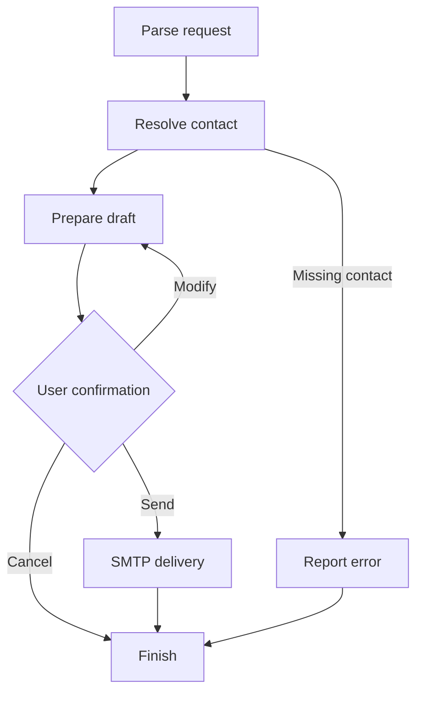

<div align="center">

# Local AI Email Assistant
**Draft an email, review it, then decide whether to send**

Python · LangGraph · Ollama · SQLite · SMTP

[Setup](#setup) · [Workflow](#workflow) · [Project structure](#project-structure)

</div>

---

## Overview

An interactive command-line assistant that interprets a natural-language request, finds a recipient, drafts an email in French, and asks for confirmation before sending through SMTP.

The language model runs through Ollama. Contacts are stored in SQLite. Message delivery uses the configured SMTP provider.

## Workflow



The CLI accepts French commands such as `Voir les contacts`, `Ajouter un contact` and email drafting requests. Use `exit`, `quit` or `q` to leave.

## Setup

Prerequisites: Python compatible with the listed dependencies, Ollama, and SMTP credentials for an account you control. Dependency versions currently use lower bounds rather than a locked environment.

```bash
git clone https://github.com/Salaheddine-Adaoui/email_agent.git
cd email_agent
python -m venv .venv
```

Activate with `source .venv/bin/activate` on Linux/macOS or `.venv\Scripts\Activate.ps1` in Windows PowerShell.

```bash
python -m pip install -r requirements.txt
ollama pull llama3.1:latest
```

Start Ollama if it is not already running. The CLI checks `http://localhost:11434` at startup.

Create a local `.env` file:

```dotenv
OLLAMA_MODEL=llama3.1:latest
OLLAMA_BASE_URL=http://localhost:11434
OLLAMA_TEMPERATURE=0

SMTP_HOST=smtp.example.com
SMTP_PORT=587
SMTP_USER=your-account@example.com
SMTP_PASSWORD=replace-with-your-smtp-credential
SMTP_USE_TLS=true
SMTP_USE_SSL=false
EMAIL_FROM=your-account@example.com
```

Replace the sample SMTP settings with your provider's configuration. Keep the file local. SMTP variables are validated when the services are imported, so configure them before starting.

```bash
python main.py
```

## Review before sending

The program displays the resolved recipient, subject and body. At the confirmation prompt:

| Input | Behavior |
| --- | --- |
| `o` / `oui` / `y` / `yes` | Send through SMTP |
| `m` | Return to the drafting node |
| Other input, including `n` | Cancel |

The current modification branch does not collect editing instructions and may keep an already complete draft unchanged. Cancel and submit a revised request when a draft needs correction.

For an initial check, use a recipient you control and cancel at the preview. The CLI invokes real SMTP delivery after confirmation; the helper `simulate_send` is not the default execution path.

## Project structure

| File | Responsibility |
| --- | --- |
| [main.py](main.py) | CLI, startup checks and contact commands |
| [src/graph.py](src/graph.py) | LangGraph workflow |
| [src/nodes.py](src/nodes.py) | Drafting, confirmation and delivery nodes |
| [src/llm_service.py](src/llm_service.py) | Ollama intent parsing and drafting |
| [src/contacts_service.py](src/contacts_service.py) | SQLite contacts |
| [src/email_service.py](src/email_service.py) | SMTP configuration and delivery |
| [src/state.py](src/state.py) | Shared agent state |

## Scope and next steps

This prototype implements drafting and sending. It does not implement inbox reading or search, even though those intent names appear in the parsing prompt.

Next steps include a working edit-feedback loop, tests with mocked SMTP/LLM services, pinned dependencies and synthetic contact fixtures. Review the tracked contacts database before sharing its contents.

*Documentation checked against the source. No email was sent and no SMTP or LLM end-to-end run was performed during this update.*
